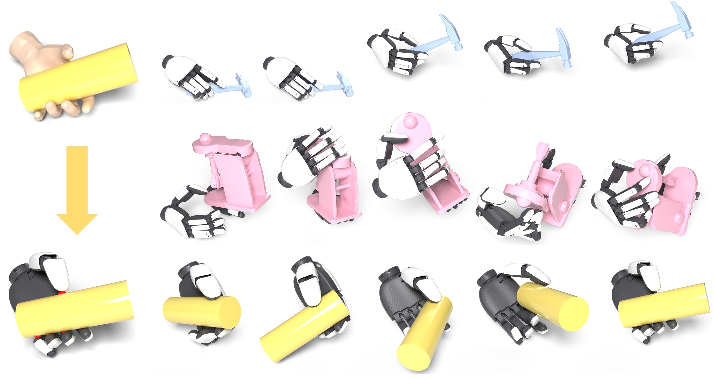

# ConTrack: Constrained Hand Motion Tracking with Adaptive Trade-off Control



[Yutong Liang](https://www.lyt0112.com), [Quanquan Peng](https://bariona.github.io/), [Ri-Zhao Qiu](https://rogerqi.github.io/), [Xiaolong Wang](https://xiaolonw.github.io/)

[Project page](https://www.lyt0112.com/projects/ConTrack)

## Installation

This release has been tested on Ubuntu 22.04.5 LTS with an NVIDIA GeForce RTX 4090, NVIDIA driver 550.144.03, Python 3.11, Isaac Sim 5.1.0, and Isaac Lab commit `42e61645c96bac08135566634785cdc87728d5ab`.

### Isaac Sim and Isaac Lab

Create and activate the conda environment.

```bash
conda create -n env_isaaclab python=3.11
conda activate env_isaaclab
```

Install Isaac Sim and PyTorch.

```bash
pip install "isaacsim[all,extscache]==5.1.0" --extra-index-url https://pypi.nvidia.com
pip install -U torch==2.7.0 torchvision==0.22.0 --index-url https://download.pytorch.org/whl/cu128
```

Install Isaac Lab.

```bash
cd
git clone https://github.com/isaac-sim/IsaacLab.git
cd IsaacLab
git checkout 42e61645c96bac08135566634785cdc87728d5ab
python -m pip install "setuptools<82" wheel
python -m pip install --no-build-isolation flatdict==4.0.1
./isaaclab.sh --install rsl-rl
```

### ConTrack Setup

```bash
cd
git clone https://github.com/EmptyBlueBox/ConTrack.git
cd ConTrack
python -m pip install -r requirements.txt
python -m pip install -e source/ConTrack
```

Optional wandb login.

```bash
export WANDB_API_KEY=XXXXX
```

### Asset Preparation

Generate simplified collision meshes.

```bash
python assets/simplify_mesh.py
```

Convert the xArm XHand URDF files to USD.

```bash
python scripts/tools/convert_urdf.py \
  assets/urdf_simplify_collision/xarm_xhand_left-simplified.urdf \
  assets/usd/xarm_xhand_left/xarm_xhand_left.usd \
  --merge-joints \
  --joint-stiffness 0.0 \
  --joint-damping 0.0 \
  --joint-target-type none \
  --headless \
  --fix-base

python scripts/tools/convert_urdf.py \
  assets/urdf_simplify_collision/xarm_xhand_right-simplified.urdf \
  assets/usd/xarm_xhand_right/xarm_xhand_right.usd \
  --merge-joints \
  --joint-stiffness 0.0 \
  --joint-damping 0.0 \
  --joint-target-type none \
  --headless \
  --fix-base
```

## Training

Replace `<data/xhand/*.h5>` with the actual path to the reference trajectory data.

```bash
CUDA_VISIBLE_DEVICES=0 python scripts/rsl_rl/train.py \
  --task Isaac-Xarm-Xhand-Mimic-Manager-v0 \
  --data <data/xhand/*.h5> \
  --experiment_name XarmXhand \
  --num_envs 8000 \
  --save_interval 200 \
  --headless \
  --logger wandb \
  --log_project_name ConTrack \
  --wandb_description test \
  --video_num_envs 9
```

## License

Repository code is released under the BSD 3 Clause License. Third-party assets, dataset clips, and code adapted from upstream projects retain their own terms.

See `THIRD_PARTY_NOTICES.md`.
